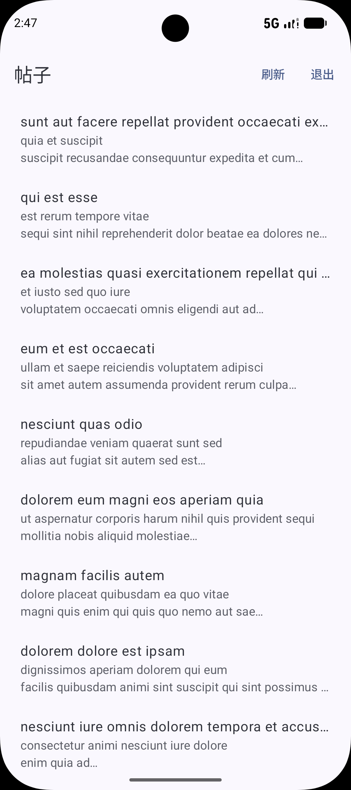
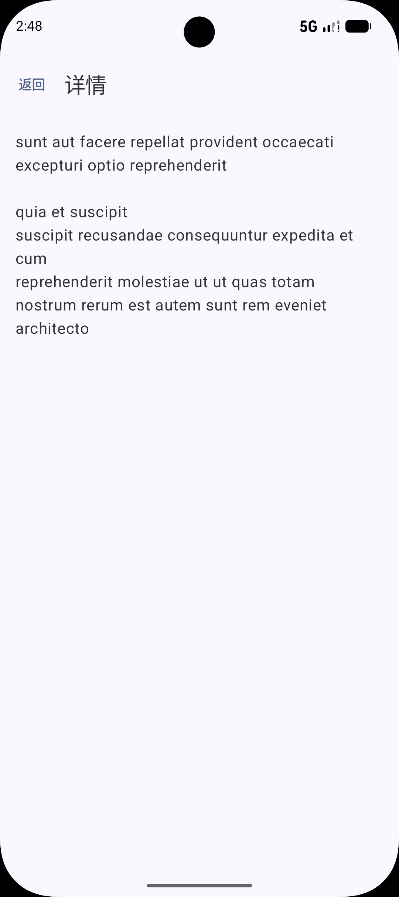

# JetpackCompose-PostsApp

> Android - 基于 Jetpack Compose 的帖子浏览应用

一款采用 MVVM 架构、Jetpack Compose 声明式 UI 构建的轻量级帖子浏览 App，实现了完整的用户认证和帖子展示功能。

---

## 📱 功能列表

| 模块 | 功能 |
|------|------|
| 🔐 认证 | 用户注册、登录、登录状态持久化、退出登录 |
| 📋 帖子 | 帖子列表展示、下拉刷新、帖子详情查看 |
| 💾 存储 | DataStore 本地存储会话，自动恢复登录状态 |

---

## 🖼️ 核心功能示意

| 登录页 | 注册页 |
|--------|--------|
|  |  |

| 帖子列表 | 帖子详情 |
|----------|----------|
|  |  |

---


## 🛠 技术栈

| 技术 | 说明 |
|------|------|
| **Jetpack Compose** | 声明式 UI 框架 |
| **MVVM** | 架构模式（ViewModel + StateFlow） |
| **Retrofit** | 网络请求 |
| **Kotlin Coroutines** | 异步编程 |
| **DataStore** | 本地会话存储 |
| **Compose Navigation** | 页面导航 |
| **手动 DI** | AppContainer 依赖管理 |

---

## 📂 项目结构

```
app/src/main/java/com/example/myapplication2/
│
├── data/
│   ├── local/
│   │   └── LocalStore.kt          # DataStore 本地存储
│   ├── remote/
│   │   ├── ApiService.kt          # Retrofit API 接口
│   │   ├── ApiServiceFactory.kt   # Retrofit 客户端工厂
│   │   └── PostDto.kt             # 网络数据模型
│   └── repository/
│       ├── AuthRepository.kt      # 认证数据仓库
│       └── PostsRepository.kt     # 帖子数据仓库
│
├── model/
│   ├── Post.kt                    # 帖子数据模型
│   └── User.kt                    # 用户数据模型
│
├── ui/
│   ├── auth/
│   │   ├── AuthViewModel.kt       # 认证 ViewModel
│   │   ├── LoginScreen.kt         # 登录页面
│   │   └── RegisterScreen.kt      # 注册页面
│   ├── posts/
│   │   ├── PostListViewModel.kt   # 帖子列表 ViewModel
│   │   ├── PostListScreen.kt      # 帖子列表页面
│   │   ├── PostDetailViewModel.kt # 帖子详情 ViewModel
│   │   └── PostDetailScreen.kt    # 帖子详情页面
│   ├── navigation/
│   │   ├── AppNavGraph.kt         # 导航图配置
│   │   └── Routes.kt              # 路由常量
│   ├── theme/                     # 主题样式
│   └── AppViewModels.kt           # ViewModel 工厂
│
├── AppContainer.kt                # 依赖容器
├── MyApplication2Application.kt   # Application
└── MainActivity.kt                # 主 Activity
```

---

## 🚀 如何运行

1. **Clone 项目**
   ```bash
   git clone https://github.com/Wanyi-Li-CN/JetpackCompose-PostsApp.git
   ```

2. **用 Android Studio 打开**

3. **运行到模拟器或真机**

---

## 🎯 项目亮点

- ✅ **完全声明式 UI**：Jetpack Compose 构建所有界面
- ✅ **分层架构**：UI Layer ↔ ViewModel ↔ Repository ↔ Data Source
- ✅ **状态管理**：StateFlow 驱动 UI 更新
- ✅ **会话持久化**：DataStore 自动保存登录状态
- ✅ **依赖注入**：手动 DI 容器管理依赖
- ✅ **导航管理**：Compose Navigation 统一路由


---

## 📄 License

MIT License
